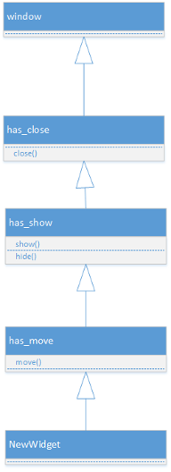

# Introduction
The Windows Template Framework (WTF) is a lightning fast, light-weight, header-only GUI library for Windows written in C++11. It's designed to be easy to use and quick to setup for a quick-and-dirty Windows GUI application. The architecture is highly modular with maximum code reuse by leveraging modern template meta-programming techniques.

WTF is largely an architectural and feasibility experiment. Maximum reuse is one of the motivating factors behind this library. There are many GUI toolkits around and they all seem to share the trait of code bloat. GUI toolkits present an interesting challenge because the various components and widgets have a mix-and-match composition of behaviors.  For example, a button contains a label that needs to produce click events while a drop-down box has several labels, produces click events and needs to editable, while a text box is editable but produces no click events. The various GUI components share a hodge-podge of behaviors and a variety of programming techniques have been employed in toolkits to minimize the maintenance effort but most fall short IMO.

WTL, for example, should be more properly named Windows Macro Library than a template library but does a fairly good job at reducing duplication.  wxWidgets has lots of duplicate code but their goal is a cross platform toolkit.  It's clumsy and difficult to learn.  Qt has a nice programmer's interface but dont peek behind the sheets if you want to keep your lunch down. WinForms is easy to code but requires a terrabyte of framework libraries, CLI interop is required to do anything native and its slow as hell. GTK is for linux. The proper response to the current state of native GUI toolkits on Windows is WTF!

# Getting Started
Add the wtf folder to the project's include path and include wtf.hpp in a compilation unit. Here's a minimal example:

~~~cpp
#include "wtf/wtf.hpp"

int main(){
  wtf::form oForm;
  return oForm.exec();
}
~~~

This creates a generic form and shows it then begins the main message pump.  To make things more exciting the forms and controls can be sub-classed and methods overridden to accomplish various tasks.  Here's a slightly more involved example:

~~~cpp
#include "wtf.hpp"

struct MyForm : wtf::form{

  MyForm() : oPanel(this){
    OnCreate += [this](){ 
      oPanel.border_style(wtf::border_styles::double_raised);
      oPanel.move(10, 10, 150, 25);
    };
  }

  wtf::panel oPanel;
};

int main(){
  MyForm oForm;
  return oForm.exec();
}

~~~

Here a form is sub-classed and it contains a panel. One important thing to notice is the constructor of the panel accepts the form as the parent e.g. `oPanel(this)` There are a number of ways to enhance the behavior and get event notifications depending on what you're trying to do. The producible events currently use a callback mechanism to _user side_ events. Most of the behaviors from an internal perspective can be modified by providing overridden functions. More advanced widgets use the template framework to generate compositional patterns of various behavioral policies to create new, feature rich GUI components.

Currently the controls and themes are limited but I'll be adding them as time permits.

# Architecture
The WTF library is partitioned into two primary layers.
1. __policy layer__ - descrete and self contained behavioral policies 
2. __user interface layer__ - GUI widgets composition of elements in the policy layer for library consumers

## The Policy Layer
Each item in the policy layer is a descrete decoration or behavioral unit. The composition of these elements produce the feature rich UI widgets with minimal duplication.
#### The Problem
So you have some code to draw a border around a control and you want to use it in a button, label and text box. You also have some code to type text into a control and you want to include it in a text box and combo box. You also want to collect click events from a button and combo box but you don't want to duplicate any of the code. The trouble comes when you try to compose these behaviors into concrete widgets using multiple inheritance and the behavior policies need to communicate with each other.  For example, the combo box might need to respond to a click event to show the list contents which makes the click event and the list display tightly coupled. The coupling might be reversed in another widget so you've got some trouble on your hands.

#### The Solution
WTF composes discrete policies in self-contained classes that can be combine to create rich components. The code which draws a border is shared with all the widgets that draw borders.  The code that produces click events is shared by all the widgets that produce click events and so on. The behaviors are chained together in a __linear class hierarchy__ at compile time to avoid multiple inheritance.  The policies use a parameterized super class template idiom which is successively composed in a linear hierarchy at compile time. Here a few simple behaviors:

~~~cpp
  template <typename _SuperT> struct has_close : _SuperT{
    void close() { ::CloseWindow(*this); }
  };

  template <typename _SuperT> struct has_show : _SuperT{
    void show(){ ::ShowWindow(*this, SW_SHOW); }
    void hide(){ ::ShowWindow(*this, SW_HIDE); }
  };
  
  template <typename _SuperT> struct has_move : _SuperT{
    void move(int x, int y, int width, int height, bool repaint = true){
      ::MoveWindow(*this, x, y, width, height, repaint ? TRUE : FALSE);
    }
  };
~~~

The parameterized super class idiom is a bit ugly but it certainly beats the alternative. Widgets inherit these behaviors by listing them during declaration:

~~~cpp
struct NewWidget : window<NewWidget, has_close, has_show, has_move>...
~~~
The NewWidget inherits from all the policies which results in a hierarchy like:

The `window` template collects all the policies into a linear class hierarchy with the top-most super class being a `window<>` specialization that holds the HWND. There is a little bit more going on with WTF implementation but for this illustration it's sufficient and useful. Between each policy is a specialization of the `window` template that assists with the construction of the hierarchy and dispatching windows messages. 

There are a number of places where ease of code and architecture were chosen over performance but they're not of much concern.  I normally frown on virtual method calls particularly in process intensive paths but this is a GUI toolkit afterall and it's not intended render 120fps. Despite the inefficiencies it will probably skill smoke wxWidgets. I'm certain it will make a mockery of Qt in the performance and footprint department.  WinForms will be several light-years behind.

### Painting
WTF widgets are owner drawn. To improve performance a single device context is created when window receives a WM_PAINT or WM_ERASEBKGND message is received and it's reused by the policy templates. This is the traditional approach but the modular architecture of WTF present a few challenges here and there. In keeping with a uniform design goal the WM_PAINT and WM_ERASEBKGND message parameters are slightly modified:

|  message  |  parameter  |  description  |
|-----------|-------------|---------------|
| WM_PAINT | wparam | `device_context*`|
| WM_PAINT | lparam | `paint_struct*` |
| WM_ERASEBKGND | wparam |`device_context*`|

Casting to and from raw pointers makes my skin crawl but it's legacy C anyway so there's little chance of avoiding it entirely. The native WM_PAINT message doesn't use either wparam or lparam so the liberty was taken to repurpose them. The native WM_ERASEBKGND passes the native device context in the wparam so it's been replaced with the convenience wrapper.

### Thread Safety
There is none. Native Windows GDI APIs aren't supposed to be run from multiple threads for the most part. In most cases, the thread that creates a GUI window must be the thread to control it and close it. Running background threads is fine but the main thread that creates the window should control the window for it's lifetime.  Bring your own synchronization.
